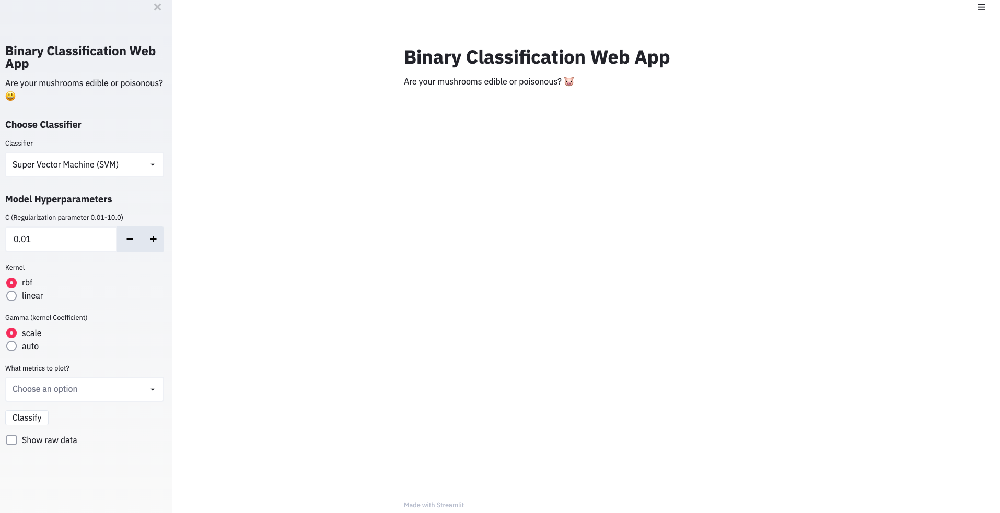

# WebApp_Binary-Classification

### Dataset Information
source: https://archive.ics.uci.edu/ml/datasets/Mushroom

###### Introduction
This data set includes descriptions of hypothetical samples corresponding to 23 species of
gilled mushrooms in the Agaricus and Lepiota Family (pp. 500-525).
Each species is identified as definitely edible, definitely poisonous, 
or of unknown edibility and not recommended. 
This latter class was combined with the poisonous one. 
The Guide clearly states that there is no simple rule for determining the edibility of a mushroom;
no rule like ``leaflets three, let it be'' for Poisonous Oak and Ivy.

### Project Aim
Every column contains a categorical data. We need to convert to numerical data types 
that be valid input of scikit-learn estimators can.
The target column we want to predict is "type". It is a binary value column,
be either "p" or "e". "p" stands for poisonous mushroom and "e" stands for
edible mushroom.

### Set up
pip install streamlit

streamlit run app.py

### How can you use this app
👍 When you first open the browser, you will see a page like this:

###### Here is a video to give a detailed illustration
